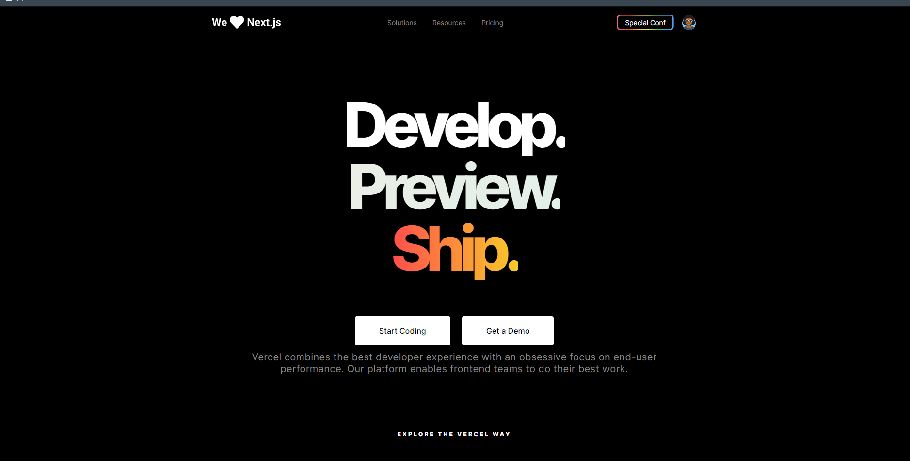

# UI CLONE SITE VERCEL 

## Utils

CSS ( Sass ) + HTML

## References

[Guilherme Rodz](https://github.com/guilhermerodz)

## Resources

- [x] HTML, SCSS, JS
- [x] SVG Images

## Start Dev Environment for VSCode

1. Open project folder in `VSCode`
2. Install `Live Server` and `Live Sass Compiler` extension
3. Right click `index.html` > `Open with Live Server`
4. Access the **generated address** in your browser 🚀

